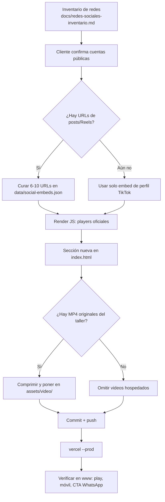

# Flujo de implementación — contenido de redes en el sitio

Este documento es el plan de trabajo.  
**Estado (6 sep 2026):** las URLs públicas ya están curadas en `docs/validacion-contenido-redes.md`. La Fase 1 se implementa sobre esas URLs (embeds oficiales, sin descargar).

Sitio: estático en Vercel. Dominio: https://www.intentandocoleccionar.autos  
Repo: https://github.com/JOTADEV12/IntentandoColeccionar

---

## Objetivo

Que el visitante **vea y reproduzca** piezas reales del taller **sin salir del sitio**, usando las mismas cuentas que ya enlazamos:

- TikTok `@intentandocoleccionar`
- Instagram `@intentando_coleccionar`
- Facebook `intentando.coleccionar`
- WhatsApp solo como CTA de cotización

---

## Principio

```
Publicación en la red  →  URL pública  →  embed oficial en nuestra página
                                      ↘  (opcional) archivo original del celular → MP4 propio
```

Nunca: red → scraper → archivo pirateado → `/assets`.

---

## Diagrama del flujo



---

## Fases

### Fase 0 — Entradas (cliente / taller)

Checklist antes de tocar HTML:

- [ ] Instagram público + Embeds activado (Ajustes → Privacidad y seguridad → Embeds).
- [ ] Lista de URLs (mínimo 4, ideal 8):

```
https://www.tiktok.com/@intentandocoleccionar/video/..........
https://www.instagram.com/reel/..........
https://www.facebook.com/reel/..........
```

- [ ] (Opcional) 2–3 videos originales `.mp4` grabados en el celular, **sin** audio de la biblioteca de TikTok/Instagram.
- [ ] Dónde se muestra: solo Home, o Home + Galería.

Si no llegan URLs, la Fase 1 igual puede salir con **solo el embed de perfil TikTok** (ya validado por oEmbed).

### Fase 1 — Embeds oficiales (recomendado, primer deploy)

**Archivos nuevos previstos** (cuando se implemente):

| Archivo | Rol |
|---|---|
| `data/social-embeds.json` | Lista curada: plataforma, url, título, pieza |
| `js/social-feed.js` | Lee el JSON, pinta blockquotes, carga `embed.js` / SDK |
| `css/social-feed.css` | Grid 9:16, lazy, fallback si el embed no carga |

**Archivos a editar:**

| Archivo | Cambio |
|---|---|
| `index.html` | Nueva sección entre “Trabajos” (fotos) y “Encuéntranos en redes”, o reemplazar esa última por “Míralos aquí + síguenos” |
| `js/site-config.js` | URLs de redes en un solo objeto (hoy WhatsApp está ahí; Instagram/TikTok/Facebook están duplicados en HTML y `experience.js`) |
| `galeria.html` | Opcional: bloque “Proceso en video” |
| `sitemap.xml` | `lastmod` de las páginas tocadas |
| `js/analytics.js` | Evento `social_embed_click` / play si es medible |

**Formato del JSON (borrador):**

```json
{
  "tiktokProfile": "https://www.tiktok.com/@intentandocoleccionar",
  "items": [
    {
      "id": "tt-001",
      "platform": "tiktok",
      "url": "https://www.tiktok.com/@intentandocoleccionar/video/ID",
      "title": "Supra naranja · proceso",
      "featured": true
    },
    {
      "id": "ig-001",
      "platform": "instagram",
      "url": "https://www.instagram.com/reel/SHORTCODE/",
      "title": "Atos taxi Bogotá"
    }
  ]
}
```

**Cómo se pinta cada plataforma:**

1. **TikTok perfil:** blockquote `class="tiktok-embed"` + `data-unique-id="intentandocoleccionar"` + `https://www.tiktok.com/embed.js`.
2. **TikTok video:** oEmbed o blockquote con `data-video-id`.
3. **Instagram:** blockquote `instagram-media` + `https://www.instagram.com/embed.js`, o HTML que devuelva `instagram_oembed`.
4. **Facebook:** plugin / oEmbed post-video + SDK `connect.facebook.net`.

**Reglas de UX:**

- Máximo 6 embeds visibles en desktop (3×2) y carrusel en móvil.
- `loading="lazy"` / Intersection Observer: no cargar 10 iframes de golpe.
- Fallback: tarjeta con enlace “Ver en TikTok / Instagram” si el script no carga.
- CTA debajo: “¿Quieres una así?” → WhatsApp.
- Respetar `prefers-reduced-motion` (sin autoplay si el usuario lo pide).
- No autoplay con sonido.

**Estimación:** 1 sesión de implementación + 1 de ajuste visual en móvil.

### Fase 1b — Videos propios hospedados (solo si mandan archivos)

1. Recibir MP4 originales (no recortes bajados de la app).
2. Comprimir a H.264, 1080×1920 o 1080×1080, AAC, &lt; 15 MB.
3. Poster WebP del primer frame → `assets/video/posters/`.
4. Video → `assets/video/proceso-xxx.mp4`.
5. `<video controls preload="none" poster="..." playsinline>` en la misma sección.
6. No mezclar en el mismo grid embeds y MP4 sin etiqueta (“En TikTok” vs “En el taller”).

Esto **no** sustituye los embeds: refuerza piezas que queremos que carguen incluso si TikTok está lento.

### Fase 2 — Feed automático (después, no ahora)

Solo si el taller publica seguido y no quiere pegar URLs:

- Instagram Graph API (cuenta Professional) **o**
- TikTok Display API (OAuth del creador)

Implica backend o cron (Vercel Function) + tokens. Fuera del alcance del sitio estático actual. Se documentaría en un MD aparte si se pide.

---

## Orden de trabajo cuando se dé luz verde

1. Congelar las URLs en `data/social-embeds.json`.
2. Implementar `js/social-feed.js` + CSS.
3. Insertar sección en `index.html` (y Galería si aplica).
4. Unificar handles en `js/site-config.js` para no seguir duplicando URLs.
5. Probar local (`npx serve` o abrir HTML): TikTok, IG, FB, WhatsApp.
6. Commit → `git push origin master` → `vercel --prod` (GitHub aún no dispara deploy solo).
7. Verificar en producción:
   - https://www.intentandocoleccionar.autos/
   - Móvil 390px y desktop
   - Un clic de cada player
   - CTA WhatsApp intacto
   - Popup de `experience.js` no tapa los videos

---

## Criterios de listo

- Al menos **un** video se reproduce en el home sin ir a otra app.
- Cada embed enlaza de vuelta a la cuenta oficial.
- Si un post se borra en la red, el resto de la sección sigue en pie (un item no tumba el grid).
- Cero scrapers, cero descargas desde las apps.
- WhatsApp sigue siendo el único camino de cotización.

---

## Riesgos y mitigación

| Riesgo | Mitigación |
|---|---|
| Cuenta Instagram privada o Embeds off | Fase 0: confirmar; si falla, solo TikTok |
| Post de Facebook no público | No incluirlo en el JSON |
| Embed.js lento | Lazy-load + fallback con enlace |
| Música con copyright en MP4 propio | Usar solo audio original o silencio |
| Repo pesado si se suben muchos MP4 | Límite 3 clips en Fase 1b |

---

## Fuera de esta implementación

- Cambiar el popup de redes (se puede alinear el copy en un paso posterior).
- Conectar GitHub → Vercel (otro ticket; hoy el deploy es `vercel --prod`).
- Instalar Python/`gh` en la máquina.

---

## Siguiente paso

Cuando el taller envíe las URLs (o confirme “hazlo solo con el perfil de TikTok”), se implementa la Fase 1 sobre este flujo, se verifica en el navegador y se despliega a Vercel.
